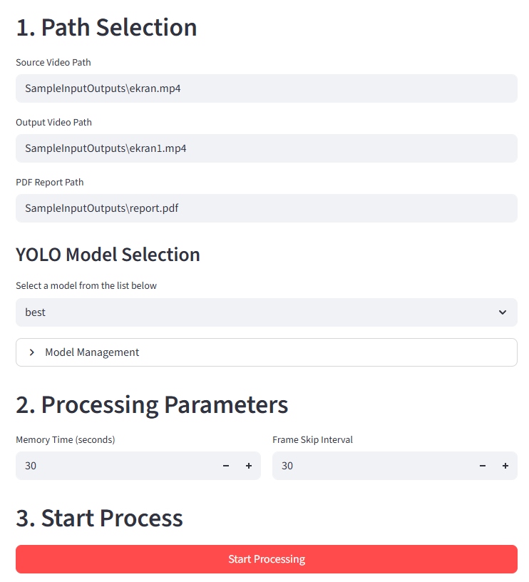
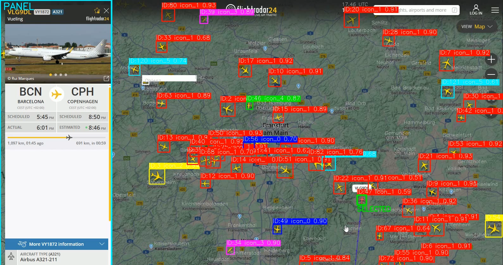
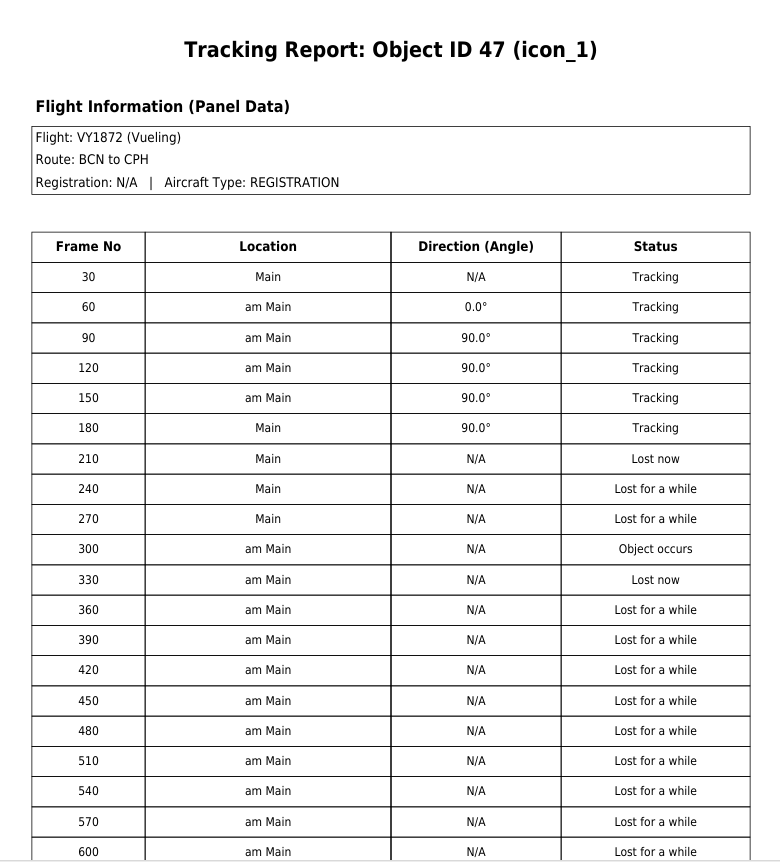

# Flight Radar Icon Detection and Tracking System

> **Project Context**
>
> This repository contains a public-facing adaptation of a comprehensive project I developed during my 3rd-year summer internship. To honor the confidentiality and non-disclosure agreement (NDA) with my host company, the original project's proprietary source code, specific business logic, and sensitive data could not be shared publicly.
>
> Therefore, I have re-implemented the core functionalities to solve a different, more general problem: detecting and tracking dynamic icons in flight radar footage. This version is designed to demonstrate the key technical skills I applied and refined during my internship, including Computer Vision with YOLO, custom AI model training, and interactive GUI development with Streamlit.

This project is a powerful AI tool designed to detect, track, and report on dynamic elements (such as aircraft, panels, etc.) in map-based video streams, like those from Flight Radar. Featuring a user-friendly web interface built with Streamlit, this tool allows you to perform video analysis using pre-trained models or train custom AI models from scratch using your own unique icon sets.

## 🚀 Key Features

*   **Dynamic Icon Detection:** Utilizes the **YOLO** algorithm to detect moving icons (aircraft, etc.) with high accuracy.
*   **Panel and Boundary Detection:** Leverages the **Canny Edge Detection** algorithm to identify the boundaries of information panels or specific regions on the map.
*   **Customizable Model Training:** Train your own YOLO models using your `.webp` icon files, enabling the system to recognize objects specific to your needs.
*   **Interactive Web Interface:** All operations—video selection, model management, training, and viewing results—are handled through a simple and intuitive interface that requires no coding knowledge.
*   **Automated Reporting:** Generates a detailed **PDF report** summarizing key events from the analyzed video (e.g., an icon appearing, disappearing, or entering a specific zone).
*   **Result Visualization:** Produces an **output video** with detected icons and events overlaid, providing a clear visual representation of the analysis.

## 🖼️ Screenshots

Here are two sample screenshots showcasing the application's interface.

**1. Main Interface and Settings:**
*A screenshot showing the application's main processing page, model selection, and parameter settings.*



**2. Processing Results:**
*A screenshot displaying the output video and the generated PDF report side-by-side after an analysis is complete.*




## ⚙️ How It Works

The project consists of two main layers: the frontend (user interface) and the backend (processing logic).

### 1. Frontend (Interface - `interface.py`)

*   **Streamlit:** The interface is built with Streamlit, a popular Python library for creating web applications. This allows complex processes to be managed through simple UI components like buttons, text boxes, and dropdown menus.
*   **State Management (`st.session_state`):** The application uses `st.session_state` to store persistent information, such as the user's current page (`main` or `train`), whether a process is running (`is_busy`), and the results from the last run (`last_video_bytes`, `last_pdf_bytes`). This ensures data is not lost on page reloads.
*   **Dynamic Page Rendering:** The `run()` method dynamically renders either the main processing page (`_draw_main_page`) or the model training page (`_draw_train_page`) based on the current state. If `is_busy` is `True`, a "processing in progress" screen is shown to the user.

### 2. Backend (Processing Logic)

This logic is triggered by the interface and is typically located in a separate file like `main.py`.

*   **Video Processing:**
    1.  The user-selected video is read frame by frame.
    2.  To improve processing speed, some frames are skipped based on the `skip_frame` parameter.
    3.  In each frame, the user-selected **YOLO model (.pt file)** is used to detect icons.
    4.  Simultaneously, the **Canny algorithm** can be used to detect edge-based structures like panels or boundaries.
    5.  The `memory_time` parameter determines how long an icon is "remembered" after it disappears from view. This helps tolerate brief occlusions (e.g., an icon passing behind a panel).
    6.  All this detected information is drawn onto the output video and logged for the PDF report.

*   **Model Training:**
    1.  On the "Train Your Model" page, the user specifies their icon `.webp` file and other parameters (number of images to generate, icon scales, etc.).
    2.  The system then generates a **synthetic training dataset** by placing these icons onto random, map-like backgrounds. This eliminates the need for manual data collection.
    3.  This dataset is used to train a new YOLO model, which is then saved to the `Models` directory with a `.pt` extension under the user-provided name.

---

## 🚀 Setup and Usage

1.  **Clone the repository:**
    ```bash
    git clone https://github.com/b2210356065/InternshipProject
    cd InternshipProject
    ```

2.  **Install the required libraries:**
    ```bash
    pip install -r requirements.txt
    ```

3.  **Run the application:**
    ```bash
    streamlit run main.py
    ```

Once started, the application will automatically open in your browser. You can now begin analyzing videos or training your own custom models.# InternshipProject
# InternshipProject
